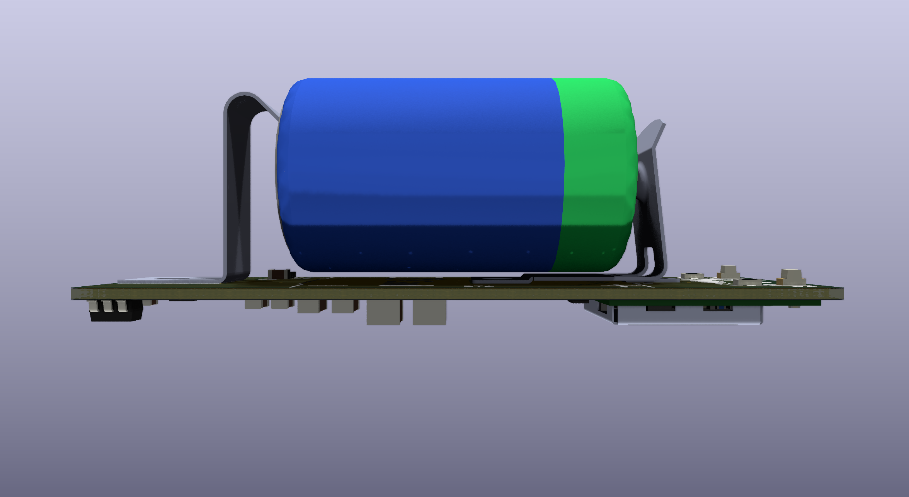

# Window Sensor


[](https://github.com/usimd/window-sensor/actions/workflows/ci.yaml)
[](https://codecov.io/gh/usimd/window-sensor)
[](https://aisler.net/p/new?url=https://raw.githubusercontent.com/usimd/window-sensor/refs/heads/main/window-sensor.kicad_pcb&ref=github)

BLE window/door sensor built around the u-blox NORA-B226 (nRF54L10). Broadcasts open/closed/tilt state via BTHome v2 non-connectable advertising. MCUboot OTA-capable.



## Hardware

- **MCU**: nRF54L10 (Cortex-M33, 1 MiB RRAM, 192 KB RAM) in u-blox NORA-B226-00B module
- **Sensor**: TMAG5273 3D Hall-effect sensor for contactless magnet detection
- **Power**: CR14250 (½AA) lithium cell, target multi-year battery life
- **Enclosure**: 3D-printed case with magnet holder (FreeCAD, `case/`)

## Firmware

Rust + Embassy async runtime, BLE via nrf-sdc + trouble-host.

- Non-connectable BTHome v2 advertising (open / closed / tilt)
- MCUboot bootloader with ed25519-signed OTA images
- Host-side unit tests for classifier and gesture logic

## Repository Structure

| Path | Description |
|---|---|
| `*.kicad_*` | KiCad 10 schematic, PCB, and project files |
| `lib/` | Local symbol/footprint libraries and 3D models |
| `firmware/` | Rust firmware (Embassy, BLE, MCUboot support) |
| `firmware/mcuboot/` | MCUboot config and partition overlay |
| `case/` | FreeCAD enclosure design and 3MF exports |
| `scripts/` | BLE scanner and dev utilities |
| `sim/` | Magnetic simulation data |

## Building

```bash
# Install toolchain
rustup target add thumbv8m.main-none-eabihf
cargo install just cargo-binutils

# Build, lint, test
just ci

# Flash (requires probe-rs + debug probe)
just run
```

## License

Dual-licensed: hardware under CERN-OHL-W-2.0, firmware under Apache-2.0. See [`LICENSE`](LICENSE).
